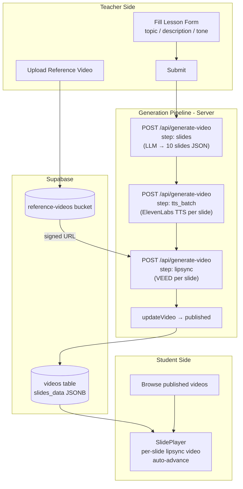
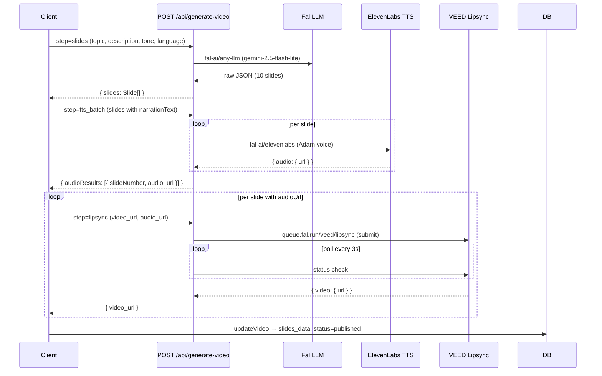

# AI Video Lesson Module — Agent Guide

This document describes the AI video lesson module end-to-end: what it does, how the data flows, what the teacher and student experiences look like, and exactly what an agent needs to build it from scratch inside a larger mobile application.

---

## Table of Contents

1. [Overview](#1-overview)
2. [Architecture](#2-architecture)
3. [External Services and Environment Variables](#3-external-services-and-environment-variables)
4. [Database Schema](#4-database-schema)
5. [Storage Buckets](#5-storage-buckets)
6. [Teacher Flow](#6-teacher-flow)
7. [AI Generation Pipeline](#7-ai-generation-pipeline)
8. [Student Flow](#8-student-flow)
9. [Core Data Structures](#9-core-data-structures)
10. [Key API Routes](#10-key-api-routes)
11. [Key Frontend Components](#11-key-frontend-components)
12. [From-Scratch Implementation Checklist](#12-from-scratch-implementation-checklist)

---

## 1. Overview

The module lets a teacher upload a short reference video of themselves talking (their "face"). When the teacher creates a lesson, the system:

1. Uses an LLM to generate 10 structured slides (with KaTeX formulas and Mermaid diagrams).
2. Converts each slide's narration text to speech (ElevenLabs TTS).
3. Runs lipsync on the teacher's reference video using the TTS audio, producing one short video clip per slide (VEED lipsync).
4. Saves all slide data — content, audio URL, lipsync video URL — to the database as a `slides_data` JSONB column.

Students open the lesson and get an interactive slide player that plays each slide's lipsync video in order, advancing automatically.

**Mobile context:** This is one module inside a larger app. You do not need the landing page, demo showcase, RAG/documents feature, or Bunny Stream CDN integration. The core is: reference video upload, lesson creation form, generation pipeline, and slide player.

---

## 2. Architecture



---

## 3. External Services and Environment Variables

### Required

| Variable | Description |
|----------|-------------|
| `NEXT_PUBLIC_SUPABASE_URL` | Supabase project URL (`https://xxx.supabase.co`) |
| `NEXT_PUBLIC_SUPABASE_ANON_KEY` | Supabase anon/public key |
| `SUPABASE_SERVICE_ROLE_KEY` | Service role key (used server-side for demo uploads and admin operations) |
| `FAL_KEY` | Fal AI API key (server-side, for LLM / TTS / Lipsync calls) |
| `NEXT_PUBLIC_FAL_KEY` | Same key exposed client-side (only needed if any client-side Fal calls remain) |

### Fal AI Models Used

| Purpose | Model path |
|---------|-----------|
| LLM (slide generation) | `fal-ai/any-llm` with model `google/gemini-2.5-flash-lite` |
| TTS (text-to-speech) | `fal-ai/elevenlabs/text-to-dialogue/eleven-v3` |
| Lipsync | `veed/lipsync` via `queue.fal.run` (async queue) |

### Optional (not needed for mobile module)

| Variable | Purpose |
|----------|---------|
| `PINECONE_API_KEY` | RAG document embedding |
| `PINECONE_INDEX_NAME` | Pinecone index for teacher documents |
| `OPENAI_API_KEY` | Embeddings for RAG |
| `BUNNY_STREAM_API_KEY` | Bunny CDN video delivery |
| `BUNNY_STREAM_LIBRARY_ID` | Bunny library |
| `VIDEO_DELIVERY_PROVIDER` | `'fal'` (default) or `'bunny'` |

### `.env.local` (minimum for the mobile module)

```env
NEXT_PUBLIC_SUPABASE_URL=https://your-project.supabase.co
NEXT_PUBLIC_SUPABASE_ANON_KEY=your-anon-key
SUPABASE_SERVICE_ROLE_KEY=your-service-role-key
FAL_KEY=your-fal-ai-key
NEXT_PUBLIC_FAL_KEY=your-fal-ai-key
```

---

## 4. Database Schema

Run `supabase/schema.sql` in the Supabase SQL Editor to create the base schema. Run the migration files afterward if you need optional features.

### `profiles` table

Extends Supabase `auth.users`. Created automatically by a trigger when a user signs up.

| Column | Type | Notes |
|--------|------|-------|
| `id` | `UUID` (PK) | References `auth.users(id)` |
| `email` | `TEXT` | Unique |
| `name` | `TEXT` | |
| `role` | `user_role` | `'teacher'` or `'student'` |
| `avatar_url` | `TEXT` | Optional |
| `school` | `TEXT` | Optional |
| `subject` | `TEXT` | Teacher only (e.g. "Matematik") |
| `grade` | `TEXT` | Student only (e.g. "8. Sınıf") |
| `reference_video_url` | `TEXT` | Teacher's reference video public URL |
| `reference_video_status` | `TEXT` | `'none'` / `'processing'` / `'ready'` |
| `saved_videos` | `UUID[]` | Student saved video IDs |
| `watched_videos` | `UUID[]` | Student watched video IDs |
| `created_at` | `TIMESTAMPTZ` | |

### `videos` table

| Column | Type | Notes |
|--------|------|-------|
| `id` | `UUID` (PK) | |
| `teacher_id` | `UUID` | FK → `profiles(id)` |
| `title` | `TEXT` | Equals `topic` on creation |
| `description` | `TEXT` | |
| `subject` | `TEXT` | |
| `grade` | `TEXT` | |
| `topic` | `TEXT` | |
| `status` | `video_status` | `'draft'` / `'processing'` / `'published'` / `'failed'` |
| `prompt` | `TEXT` | Style hint or empty |
| `tone` | `video_tone` | `'formal'` / `'friendly'` / `'energetic'` |
| `language` | `TEXT` | `'tr'` or `'en'` |
| `includes_problem_solving` | `BOOLEAN` | |
| `problem_count` | `INTEGER` | |
| `difficulty` | `video_difficulty` | `'easy'` / `'medium'` / `'hard'` |
| `estimated_duration` | `INTEGER` | Minutes |
| `duration` | `INTEGER` | Seconds (set after generation: `slides * 30`) |
| `slides_data` | `JSONB` | Core payload — see structure below |
| `video_url` | `TEXT` | Unused for slide-based lessons |
| `thumbnail_url` | `TEXT` | |
| `view_count` | `INTEGER` | |
| `like_count` | `INTEGER` | |
| `video_provider` | `TEXT` | `'fal'` or `'bunny'` (from migration) |
| `bunny_ingestion_status` | `TEXT` | Optional Bunny status |
| `created_at` | `TIMESTAMPTZ` | |

### `slides_data` JSONB structure

This is the entire lesson content stored in one column:

```json
{
  "slides": [
    {
      "slideNumber": 1,
      "title": "Newton'un Hareket Yasaları",
      "content": "$$F = ma$$\n\nKuvvet, kütle ile ivmenin çarpımına eşittir.",
      "bulletPoints": [
        "Birinci Yasa: Eylemsizlik",
        "İkinci Yasa: $F = ma$",
        "Üçüncü Yasa: Etki-Tepki"
      ],
      "narrationText": "Newton'un ikinci yasasına göre bir cisme etki eden net kuvvet, o cismin kütlesi ile ivmesinin çarpımına eşittir.",
      "audioUrl": "https://fal.media/files/.../audio.mp3",
      "videoUrl": "https://fal.media/files/.../lipsync.mp4"
    }
  ]
}
```

### `video_analytics` table

| Column | Type | Notes |
|--------|------|-------|
| `id` | `UUID` (PK) | |
| `video_id` | `UUID` | FK → `videos(id)` |
| `user_id` | `UUID` | FK → `profiles(id)` |
| `watched_duration` | `INTEGER` | Seconds watched |
| `completed` | `BOOLEAN` | |
| `liked` | `BOOLEAN` | |

### Database trigger (critical)

This function runs automatically when a user signs up via Supabase Auth and creates their `profiles` row:

```sql
CREATE OR REPLACE FUNCTION public.handle_new_user()
RETURNS TRIGGER AS $$
BEGIN
  INSERT INTO public.profiles (id, email, name, role)
  VALUES (
    NEW.id,
    NEW.email,
    COALESCE(NEW.raw_user_meta_data->>'name', 'User'),
    COALESCE((NEW.raw_user_meta_data->>'role')::user_role, 'student')
  );
  RETURN NEW;
END;
$$ LANGUAGE plpgsql SECURITY DEFINER;

CREATE TRIGGER on_auth_user_created
  AFTER INSERT ON auth.users
  FOR EACH ROW EXECUTE FUNCTION public.handle_new_user();
```

### Required migrations (run after `schema.sql`)

| File | What it adds |
|------|-------------|
| `supabase/add-bunny-stream.sql` | `video_provider`, `bunny_ingestion_status` columns on `videos` |
| `supabase/add-rag-support.sql` | `teacher_documents` table (skip if not using RAG) |
| `supabase/add-image-extraction.sql` | `document_images` table (skip if not using RAG) |

---

## 5. Storage Buckets

Create three buckets in Supabase Dashboard → Storage:

| Bucket name | Visibility | Purpose |
|-------------|-----------|---------|
| `reference-videos` | Private | Teacher reference video files |
| `generated-videos` | Public | (Reserved for future use) |
| `thumbnails` | Public | Video thumbnail images |

### Reference video path convention

```
reference-videos/{userId}/{timestamp}.{ext}
```

The app always picks the **most recent** file under `userId/` using `created_at` descending. It generates a **signed URL** (1-hour expiry) for playback and for passing to lipsync.

### Storage policies (run `supabase/storage-policies.sql` or set manually)

- `reference-videos`: authenticated teachers can upload/read their own folder; service role has full access.
- `generated-videos`, `thumbnails`: public read; authenticated write.

---

## 6. Teacher Flow

### Step 1 — Sign Up

Teacher signs up at `/signup`:
- Selects role "Öğretmenim" (teacher).
- Fills name, email, school (optional), subject (branch), password.
- `supabase.auth.signUp` is called with `options.data = { name, role, school, subject }`.
- The DB trigger creates a `profiles` row.
- The app waits 1 second, then updates `profiles` with additional fields and fetches the profile.
- The auth store (`useAuthStore`) persists `user` + `isAuthenticated` in localStorage via Zustand `persist`.

**Duplicate email detection:** Supabase returns a user with `identities: []` instead of an error when email confirmation is on. The app checks for this and throws the correct error.

### Step 2 — Upload Reference Video

Route: `/dashboard/teacher/reference`

1. Teacher picks a video file (MP4/MOV/WebM, max 500MB, ideally 2–5 minutes of themselves talking to camera).
2. Client calls `uploadReferenceVideo(userId, file)` from `src/lib/api/storage.ts`.
3. File is stored at `reference-videos/{userId}/{timestamp}.{ext}`.
4. Public URL is returned and can optionally be written to `profiles.reference_video_url`.
5. On load, the page calls `getReferenceVideoUrl(userId)` to show the existing video via signed URL.

**This step is required for lipsync.** Without a reference video, the pipeline skips the lipsync stage and the lesson will have audio only (fallback mode in the player).

### Step 3 — Create Lesson

Route: `/dashboard/teacher/create`

The form is a 3-step wizard:

| Step | Fields |
|------|--------|
| 1 — Ders Bilgileri | `subject`, `grade`, `topic` |
| 2 — İçerik | `description` (style hints + topic detail), `tone` |
| 3 — Ayarlar | `includesProblemSolving`, `problemCount`, `difficulty`, `estimatedDuration`, `language` |

On submit:
1. `createVideo(teacherId, formData)` inserts a row into `videos` with `status: 'processing'`.
2. `getReferenceVideoUrl(userId)` fetches the teacher's signed reference video URL.
3. `generateVideo(options)` runs the full pipeline (see Section 7).
4. On success, redirect to `/dashboard/teacher/videos`.

### Step 4 — View Lesson

Route: `/dashboard/teacher/videos/[id]`

- Loads `video.slidesData` from DB via `fetchVideoById`.
- Fetches the reference video signed URL via `getReferenceVideoUrl(userId)`.
- Renders `<SlidePlayer slidesData={video.slidesData} referenceVideoUrl={refVideoUrl} />`.

---

## 7. AI Generation Pipeline

All pipeline calls are made client-side by `src/lib/api/generation.ts` via `POST /api/generate-video`. The server route handles the actual Fal AI calls.

### Full sequence



### Stage 1: Slide Generation (`step: 'slides'`)

**Request:**
```json
{
  "step": "slides",
  "topic": "Newton'un Hareket Yasaları",
  "description": "Fizik dersi, 10. sınıf. Eğlenceli ve akılda kalıcı olsun.",
  "prompt": "",
  "language": "tr",
  "tone": "friendly",
  "includesProblemSolving": true,
  "problemCount": 2,
  "difficulty": "medium"
}
```

**Response:**
```json
{
  "slides": [
    {
      "slideNumber": 1,
      "title": "...",
      "content": "KaTeX + Mermaid markdown",
      "bulletPoints": ["...", "..."],
      "narrationText": "Plain spoken text, no LaTeX symbols"
    }
  ],
  "stage": "slides_complete"
}
```

LLM system prompt produces exactly 10 slides. Content uses KaTeX (`$...$` inline, `$$...$$` block) with double-escaped backslashes for JSON safety (`\\\\frac`). A custom `sanitizeLatexInJson` function post-processes the LLM output before `JSON.parse`.

**narrationText rule:** Must be plain spoken language. No `$`, `\frac`, or any LaTeX. Write "F eşittir m çarpı a" instead of `$F=ma$`.

Progress: 0–10%

### Stage 2: TTS Batch (`step: 'tts_batch'`)

**Request:**
```json
{
  "step": "tts_batch",
  "slides": [
    { "slideNumber": 1, "narrationText": "Newton'un ikinci yasasına göre..." }
  ],
  "language": "tr"
}
```

**Response:**
```json
{
  "audioResults": [
    { "slideNumber": 1, "audio_url": "https://fal.media/files/.../audio.mp3" }
  ],
  "stage": "tts_batch_complete"
}
```

Voice: `Adam` (ElevenLabs male voice). If a slide fails TTS, it gets `audio_url: ''` and lipsync is skipped for that slide.

Progress: 10–25%

### Stage 3: Lipsync per slide (`step: 'lipsync'`)

Called once per slide that has an `audioUrl`. Runs sequentially.

**Request:**
```json
{
  "step": "lipsync",
  "video_url": "https://...signed-reference-video.mp4",
  "audio_url": "https://fal.media/files/.../slide1.mp3"
}
```

**Response:**
```json
{
  "video_url": "https://fal.media/files/.../lipsync-slide1.mp4",
  "stage": "lipsync_complete"
}
```

Internally the server:
1. `POST queue.fal.run/veed/lipsync` → `{ request_id }`.
2. Polls `queue.fal.run/veed/lipsync/requests/{id}/status` every 3 seconds.
3. On `COMPLETED`, fetches `queue.fal.run/veed/lipsync/requests/{id}` → `result.video.url`.
4. Max wait: 6 minutes. If a slide times out or fails, the error is caught and that slide gets no `videoUrl`; the pipeline continues.

Progress: 25–93% (scaled by `completedSlides / totalSlidesWithAudio`)

### Stage 4: Save (`updateVideo`)

```ts
updateVideo(videoId, {
  slidesData: { slides },     // full Slide[] with audioUrl + videoUrl per slide
  status: 'published',
  duration: slides.length * 30,  // estimated seconds
  videoProvider: 'fal',
})
```

Progress: 97–100%

### Error handling

If any stage throws, the pipeline calls:
```ts
updateVideo(videoId, { status: 'failed' })
onProgress({ stage: 'failed', error: errorMessage })
```

---

## 8. Student Flow

### Step 1 — Sign Up

Same `/signup` page, student role selected ("Öğrenciyim"). Additional field: `grade` (class level).

### Step 2 — Browse Lessons

Route: `/dashboard/student/browse`

Queries `videos` table with `status = 'published'`, optionally filtered by `subject` / `grade`. Returns `Video[]` mapped from DB rows.

### Step 3 — Watch a Lesson

Route: `/dashboard/student/watch/[id]`

1. `fetchVideoById(id)` loads the video with `slidesData`.
2. `getReferenceVideoUrl(video.teacherId)` fetches the teacher's reference video signed URL (used as fallback if a slide has no lipsync video).
3. `<SlidePlayer slidesData={video.slidesData} referenceVideoUrl={refVideoUrl} />` renders.
4. `incrementVideoView(videoId, userId, watchedDuration)` records analytics.

### Playback behavior

The player has two modes per slide:

| Mode | When | Video element | Audio element |
|------|------|--------------|--------------|
| **Lipsync mode** | `slide.videoUrl` or `slide.bunnyEmbedUrl` exists | Plays lipsync MP4/HLS (with audio) | Not used |
| **Fallback mode** | No lipsync video | Reference video (muted, looping) | `slide.audioUrl` drives timing |

In both modes, when the primary media ends, the player automatically advances to the next slide. On the last slide it stops.

---

## 9. Core Data Structures

```typescript
// A single slide in the lesson
interface Slide {
  slideNumber: number;
  title: string;
  content: string;          // KaTeX + Mermaid markdown
  bulletPoints: string[];
  narrationText: string;    // plain spoken text
  audioUrl?: string;        // ElevenLabs TTS output URL
  videoUrl?: string;        // VEED lipsync output URL (fal.media)
  bunnyVideoGuid?: string;  // optional Bunny CDN GUID
  bunnyEmbedUrl?: string;   // optional Bunny HLS URL
}

interface SlidesData {
  slides: Slide[];
}

interface Video {
  id: string;
  teacherId: string;
  teacherName: string;
  teacherAvatar?: string;
  title: string;
  description: string;
  subject: string;
  grade: string;
  topic: string;
  thumbnailUrl: string;
  videoUrl?: string;
  slidesData?: SlidesData;
  duration: number;           // seconds
  status: 'draft' | 'processing' | 'published' | 'failed';
  viewCount: number;
  createdAt: Date;
  prompt: string;
  tone: 'formal' | 'friendly' | 'energetic';
  language: 'tr' | 'en';
  includesProblemSolving: boolean;
  problemCount?: number;
  difficulty?: 'easy' | 'medium' | 'hard';
  videoProvider?: 'fal' | 'bunny';
  bunnyIngestionStatus?: string;
}

interface Teacher {
  id: string;
  email: string;
  name: string;
  role: 'teacher';
  school?: string;
  subject: string;
  referenceVideoUrl?: string;
  referenceVideoStatus: 'none' | 'processing' | 'ready';
  bio?: string;
  createdAt: Date;
}

interface Student {
  id: string;
  email: string;
  name: string;
  role: 'student';
  school?: string;
  grade: string;
  savedVideos: string[];
  watchedVideos: string[];
  createdAt: Date;
}
```

---

## 10. Key API Routes

All routes live under `src/app/api/`.

### `POST /api/generate-video`

The central server-side route for all generation steps. All Fal AI calls happen here (keeps API key server-side).

**Common error shape:**
```json
{ "error": "Error message string" }
```
Status `400` for validation, `500` for runtime errors.

#### `step: 'slides'`
Generate 10 slides from topic + description using LLM.

Request fields: `topic`, `description`, `prompt?`, `language?` (default `'tr'`), `tone?` (default `'friendly'`), `includesProblemSolving?`, `problemCount?`, `difficulty?`, `ragContext?`, `sourceOnly?`.

Response: `{ slides: Slide[], stage: 'slides_complete' }`

#### `step: 'tts_batch'`
Batch TTS for all slides.

Request fields: `slides: Array<{ slideNumber, narrationText }>`, `language?`.

Response: `{ audioResults: Array<{ slideNumber, audio_url }>, stage: 'tts_batch_complete' }`

#### `step: 'tts_slide'`
TTS for a single slide (used by demo).

Request fields: `narrationText`, `slideNumber?`, `language?`.

Response: `{ audio_url, slideNumber, stage: 'tts_slide_complete' }`

#### `step: 'lipsync'`
Run VEED lipsync on one slide. Server polls until complete (up to 6 min).

Request fields: `video_url` (reference video), `audio_url` (TTS audio).

Response: `{ video_url, stage: 'lipsync_complete' }`

#### `step: 'demo_content'`
Generate a short 2–3 sentence narration for the landing page demo.

Request fields: `demoTopic`, `demoSubject`, `language?`.

Response: `{ text, stage: 'demo_content_complete' }`

#### `step: 'rag_retrieve'` (optional)
Retrieve relevant document chunks from Pinecone.

Request fields: `query`, `teacherId`, `documentIds?`.

Response: `{ context: string }`

#### `step: 'bunny_ingest_batch'` (optional)
Upload lipsync videos to Bunny Stream CDN.

Request fields: `slides: Array<{ slideNumber, videoUrl? }>`, `videoTitle?`.

Response: `{ ingestionResults: Array<{ slideNumber, bunnyVideoGuid, bunnyEmbedUrl, status }>, stage: 'bunny_ingest_complete' }`

---

### `POST /api/demo-upload`

Server-side video upload for unauthenticated demo users on the landing page.

Request: `multipart/form-data` with field `file` (video, max 100MB).

Response: `{ url: string }` (public Supabase storage URL)

Uses `SUPABASE_SERVICE_ROLE_KEY` to bypass RLS. Stores file at `reference-videos/demo/{timestamp}_{filename}`.

---

## 11. Key Frontend Components

### `SlideRenderer` (`src/components/dashboard/SlideRenderer.tsx`)

Renders a single slide's visual content.

Props: `slide: Slide`, `className?: string`

Rendering steps:
1. Extracts `` ```mermaid ``` `` blocks from `slide.content` and replaces with placeholder divs.
2. Converts `$...$` (inline) and `$$...$$` (block) to KaTeX HTML.
3. Converts `\n` to `<br>`.
4. Sets resulting HTML via `innerHTML`.
5. Calls `mermaid.render()` async on each placeholder, replaces with SVG.
6. Renders `slide.bulletPoints` the same way (KaTeX in bullets).

Dependencies: `katex`, `mermaid`

---

### `SlidePlayer` (`src/components/dashboard/SlidePlayer.tsx`)

Interactive lesson player. Manages playback across all slides.

Props:
```typescript
{
  slidesData: SlidesData;
  referenceVideoUrl?: string | null;
  title?: string;
  className?: string;
}
```

Key behaviors:
- Maintains `currentSlideIndex`, `isPlaying`, `isMuted`, `mediaProgress`, `mediaDuration`.
- On slide change: destroys previous HLS instance, loads new video/audio sources.
- **Lipsync mode:** `slide.videoUrl` → `<video>` plays with audio. Duration of that video drives the progress bar. On `ended`, advance to next slide.
- **Fallback mode:** `<audio src={slide.audioUrl}>` drives timing. `<video src={referenceVideoUrl} muted loop autoPlay>` plays independently in the overlay.
- HLS support: Uses `hls.js` for `.m3u8` URLs (Bunny CDN). Falls back to native HLS (Safari) or direct MP4.
- Draggable video overlay: Teacher video appears bottom-left by default. Can be dragged and snaps to any corner (FaceTime-style).
- Keyboard shortcuts: `Space`/`k` = play/pause, `→`/`←` = next/prev slide, `m` = mute, `f` = fullscreen.

---

## 12. From-Scratch Implementation Checklist

Use this as an ordered task list for an agent building this module inside a new mobile app.

### Infrastructure

- [ ] **Create Supabase project** at supabase.com.
- [ ] **Run `supabase/schema.sql`** in SQL Editor (creates `profiles`, `videos`, `video_analytics` tables, enums, RLS policies, triggers).
- [ ] **Run `supabase/add-bunny-stream.sql`** to add `video_provider` / `bunny_ingestion_status` columns on `videos`.
- [ ] **Create storage buckets**: `reference-videos` (private), `generated-videos` (public), `thumbnails` (public).
- [ ] **Apply storage policies** from `supabase/storage-policies.sql` or set manually in Dashboard.
- [ ] **Get Fal AI key** at fal.ai → create API key.
- [ ] **Populate `.env.local`** with Supabase URL, anon key, service role key, FAL_KEY.

### Auth module

- [ ] Implement `signUp(email, password, name, role, school?, subject?, grade?)`:
  - Call `supabase.auth.signUp` with `options.data` containing user metadata.
  - Detect duplicate email via `authData.user.identities.length === 0`.
  - Wait ~1s for trigger, then fetch `profiles` row (retry up to 3x with 500ms delay).
- [ ] Implement `signIn(email, password)`: `supabase.auth.signInWithPassword` → fetch `profiles` row.
- [ ] Implement `signOut`: `supabase.auth.signOut`.
- [ ] Persist auth state (Zustand + localStorage or equivalent mobile async storage).

### Reference video upload

- [ ] Build upload screen for teachers.
- [ ] Validate: video MIME type, max 500MB.
- [ ] Call `supabase.storage.from('reference-videos').upload('{userId}/{timestamp}.{ext}', file)`.
- [ ] On load, list `reference-videos/{userId}/`, sort by `created_at` desc, call `createSignedUrl` on the latest file and display.

### Lesson creation (teacher)

- [ ] Build form with fields: `subject`, `grade`, `topic`, `description`, `tone` (formal/friendly/energetic), `language` (tr/en), optional problem-solving settings.
- [ ] On submit:
  1. Insert `videos` row with `status: 'processing'` via `createVideo`.
  2. Get reference video signed URL via `getReferenceVideoUrl(userId)`.
  3. Call `generateVideo(options)` — runs the pipeline below.
  4. On completion, navigate to lesson list.

### Generation pipeline (`src/lib/api/generation.ts` equivalent)

- [ ] `POST /api/generate-video` with `step: 'slides'` → get 10 slides.
- [ ] `POST /api/generate-video` with `step: 'tts_batch'` → get `audioUrl` per slide.
- [ ] If `referenceVideoUrl` exists, loop `POST /api/generate-video` with `step: 'lipsync'` per slide → get `videoUrl` per slide.
- [ ] `updateVideo(videoId, { slidesData: { slides }, status: 'published', duration: slides.length * 30 })`.
- [ ] Handle failures: set `status: 'failed'`, surface error to UI.

### Server API route (`src/app/api/generate-video/route.ts` equivalent)

Implement `POST /api/generate-video` on the server with these `step` handlers:

- [ ] **`slides`**: Call `fal.run/fal-ai/any-llm` with `model: 'google/gemini-2.5-flash-lite'`, system prompt enforcing 10 slides, KaTeX formulas, plain narrationText. Strip markdown fences, run LaTeX sanitizer, `JSON.parse`, return `slides[]`.
- [ ] **`tts_batch`**: For each slide, call `fal.run/fal-ai/elevenlabs/text-to-dialogue/eleven-v3` with `inputs: [{ text, voice: 'Adam' }]`. Return `audioResults[]`.
- [ ] **`lipsync`**: Submit to `queue.fal.run/veed/lipsync`, poll `/status` every 3s, fetch result on `COMPLETED`. Return `{ video_url }`.

**LaTeX sanitizer (critical):** The LLM writes `\frac` inside JSON strings, which breaks `JSON.parse`. Scan character by character: when inside a JSON string and a `\` is found, check if the next character is a valid JSON escape (`"`, `\`, `/`, `b`, `f`, `n`, `r`, `t`, `u`). If it's a LaTeX command (e.g. `\frac` → `\f` followed by `r`), double the backslash. See `sanitizeLatexInJson` in `src/app/api/generate-video/route.ts`.

### Slide rendering

- [ ] Install `katex` and `mermaid`.
- [ ] Implement `renderMathInText(text)`: replace `$$...$$` with KaTeX block HTML, `$...$` with KaTeX inline HTML, `\n` with `<br>`.
- [ ] Implement `processMermaidBlocks(content)`: extract `` ```mermaid ``` `` blocks, render to SVG via `mermaid.render()` async, replace placeholders.
- [ ] Render `slide.title`, `slide.content` (via innerHTML), `slide.bulletPoints` (each through KaTeX).

### Slide player

- [ ] Build a player component with `currentSlideIndex` state.
- [ ] Per slide: if `slide.videoUrl`, play it as primary media (with audio). Else: play `slide.audioUrl` as primary + loop reference video (muted) in overlay.
- [ ] HLS support for Bunny CDN URLs (`.m3u8`): use `hls.js` or native HLS.
- [ ] On primary media `ended`: advance to next slide or stop on last.
- [ ] Controls: play/pause, prev/next, seek bar, mute, fullscreen.
- [ ] Teacher video overlay: small draggable PiP-style element, snaps to corners.

### Student browse/watch

- [ ] List `videos` with `status = 'published'` from DB.
- [ ] On open: load `video.slidesData`, fetch teacher's reference video signed URL via `getReferenceVideoUrl(video.teacherId)`.
- [ ] Render `<SlidePlayer>` with both.
- [ ] Record view analytics: insert `video_analytics` row with `video_id`, `user_id`, `watched_duration`.

---

## Notes for Mobile Port

When porting to a native mobile module (React Native, Flutter, etc.):

- The entire `POST /api/generate-video` route must remain server-side (or be ported to a backend service). The FAL_KEY must never be exposed to clients.
- `hls.js` is web-only; use native HLS players (`AVPlayer` on iOS, `ExoPlayer` on Android).
- KaTeX has a React Native port (`react-native-katex`) or can be rendered in a `WebView`.
- Mermaid diagrams are SVG — render in a `WebView` or use a server-side SVG generation approach.
- Supabase JS client (`@supabase/supabase-js`) works in React Native. For Flutter, use `supabase-flutter`.
- Signed URL expiry is 1 hour; refresh before playback if the user has had the app open longer than that.
- The drag gesture on the teacher video overlay maps naturally to pan gesture handlers in mobile frameworks.
