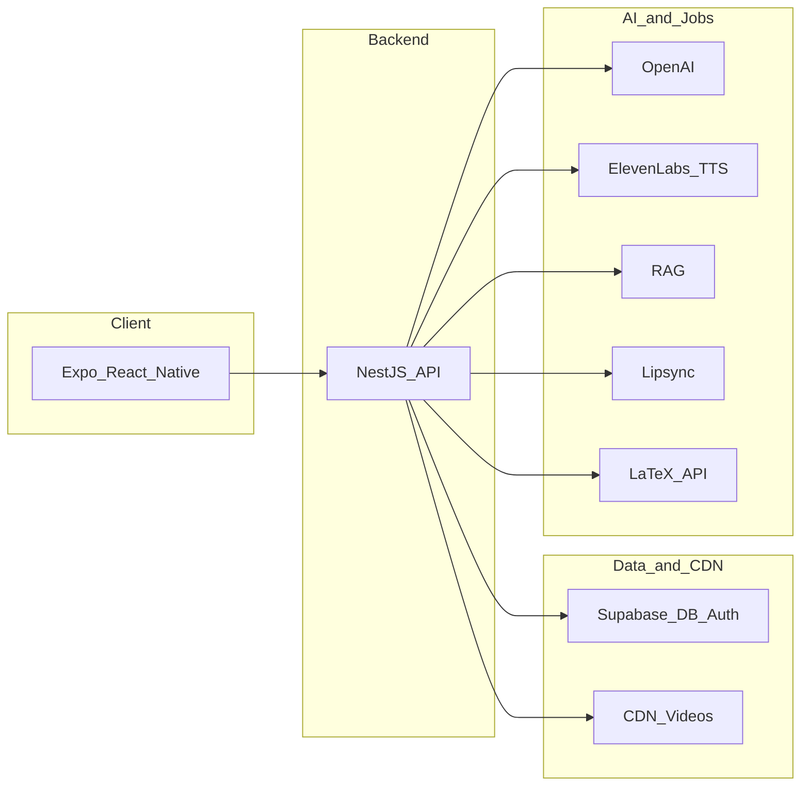
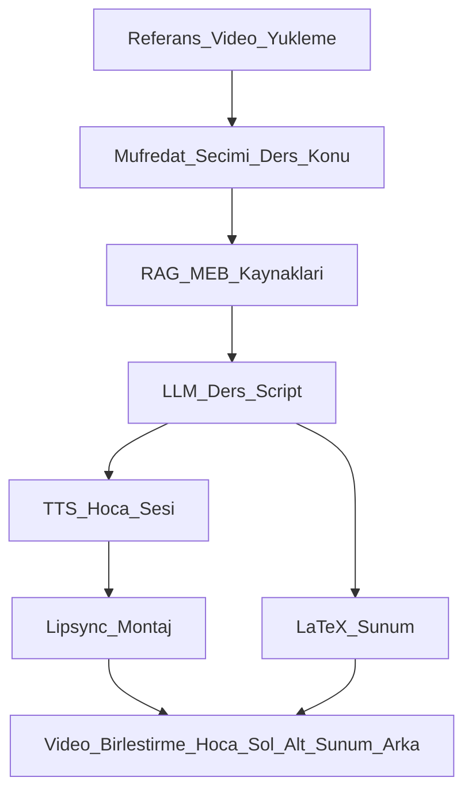
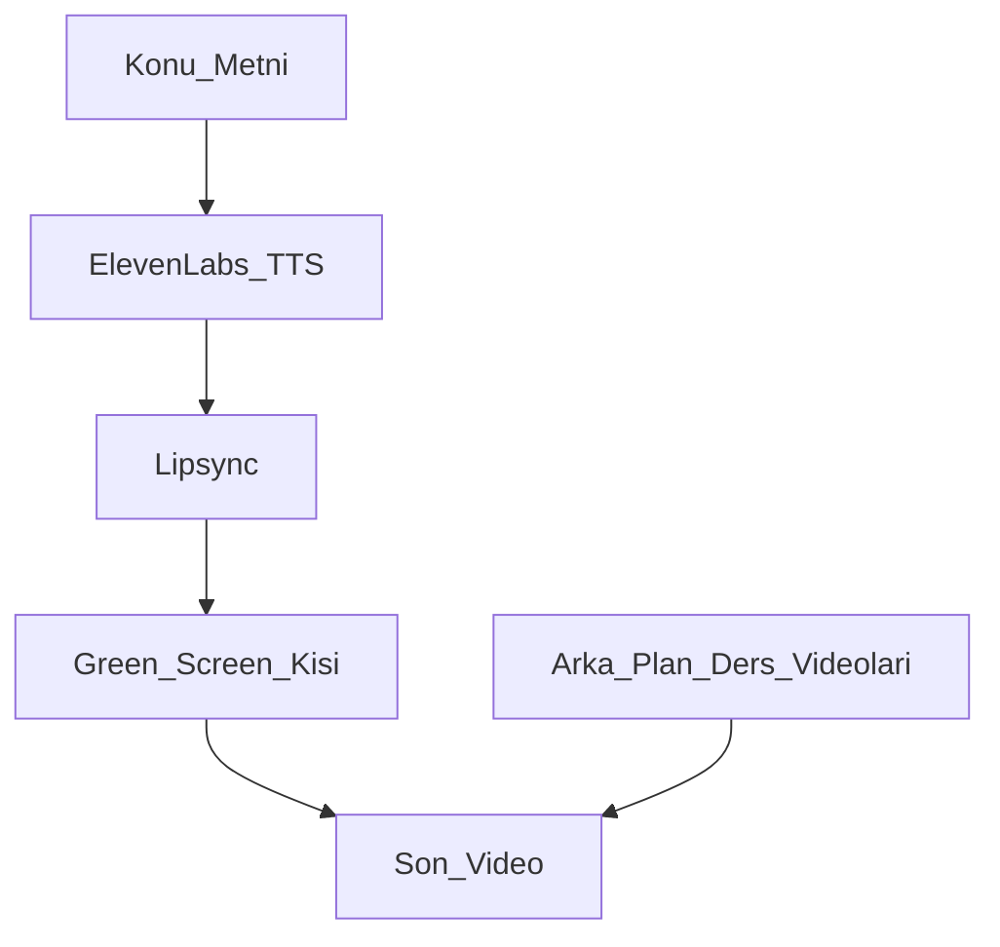

# Scrollio — Uygulama Dokümanı

Bu doküman Scrollio uygulamasının ne yaptığını, tech stack’i, pipeline/API/teknoloji kullanımını özetler. İki ana modül **Core** ve **Kids** (School modülü dahil) olarak ayrılmıştır.

---

## 1. Genel

### Scrollio nedir?

Scrollio, pasif kaydırma süresini **ölçülebilir öğrenmeye** dönüştüren bir mikro-öğrenme platformudur. TikTok tarzı kısa eğitim videoları, AI anlatıcılar, interaktif quiz’ler ve gamification ile kullanıcıların kısa sürede öğrenmesini hedefler.

**Hedef kitle:**
- **13+ öğrenenler:** Genç yetişkinler ve profesyoneller; kısa videolarla öğrenmek isteyenler.
- **7–12 yaş çocuklar:** Ebeveyn kontrollü, güvenli ve oyun/yaratıcılık odaklı deneyim.
- **Ebeveynler:** Çocuklarının ekran süresi, aktivite ve ilerlemesini takip edenler.

### Ürün yapısı

İki ana modül vardır:

| Modül | Açıklama |
|-------|----------|
| **Core** | Ana uygulama (13+). SignIn, MainTabs, Feed, Profile, Chat, Playground, Friends vb. |
| **Kids** | 7–12 yaş için ebeveyn kontrollü deneyim. Core içinde tek bir ekran (“Scrollio Kids (7–12)”) olarak açılır; kendi auth, çocuk seçimi ve tab’ları vardır. **School** modülü Kids’e dahildir. |

Mimari özet:

```
[Telefon / Web]  →  Expo (React Native)  →  Backend (NestJS :3000)  →  Supabase (PostgreSQL + Auth)
       │                      │                        │
       │                      │                        ├── /api/v1/*        (Core API)
       │                      │                        └── /api/v1/kids/*   (Kids API)
       │                      └── API client (Bearer, X-Child-Profile-Id for Kids)
       └── Redux (auth, feed, kidsAuth, kidsFeed, …)
```

### Tech stack özeti

| Katman | Teknolojiler |
|--------|----------------|
| **Frontend** | React Native, Expo, TypeScript, Redux Toolkit, React Navigation, expo-av |
| **Backend** | NestJS (API katmanı), Supabase (PostgreSQL, Auth, Realtime, Storage) |
| **Video** | BunnyCDN / AWS S3 + CloudFront (CDN ile dağıtım) |
| **AI** | OpenAI (GPT-4, içerik/script), ElevenLabs (TTS). RAG, lipsync, LaTeX API (School ve Core pipeline) |
| **Otomasyon** | n8n veya backend job’ları (TTS + lipsync pipeline) |

---

## 2. Tech Stack (Detaylı)

Tüm bileşenler tek listede toplanmıştır; eksik bırakılmamıştır.

### Mobil (React Native / Expo)

| Bileşen | Sürüm / Not |
|---------|-------------|
| React Native | 0.81+ |
| Expo | SDK 54+ |
| TypeScript | 5.x |
| Redux Toolkit | State yönetimi |
| React Navigation | v6 (stack + tab) |
| expo-av | Video oynatma |
| react-native-reanimated | Animasyonlar |
| react-native-gesture-handler | Jestler (kaydırma, pan) |
| react-native-svg | İkonlar, çizimler |

### Backend

| Bileşen | Açıklama |
|---------|----------|
| NestJS | API framework |
| TypeScript | Dil |
| Supabase | getClient() (anon), getAdminClient() (service_role, RLS bypass) |
| JWT | Supabase Auth token’ları |
| class-validator | DTO doğrulama |
| bcrypt | Kids parent PIN hash |
| Swagger/OpenAPI | API dokümantasyonu (`/api` veya `/api/docs`) |

### Veritabanı

| Bileşen | Açıklama |
|---------|----------|
| PostgreSQL | Supabase üzerinden |
| RLS | Row Level Security |
| Migrations | `code/supabase/migrations/`, `backend/sql/` |

### Kimlik doğrulama ve yetkilendirme

| Ortam | Detay |
|-------|--------|
| Core | Supabase Auth (email/şifre); JWT Bearer; profil, takip, feed |
| Kids | Aynı Supabase Auth + parent PIN (SetPin/PinEntry); çocuk profili; `X-Child-Profile-Id` header; RolesGuard (`parent`, `school`) |

### Video depolama ve dağıtım

| Bileşen | Kullanım |
|---------|----------|
| BunnyCDN | Backend .env’de tanımlı (BUNNY_CDN_URL, BUNNY_STORAGE_*); video URL’leri |
| AWS S3 + CloudFront | Brain dokümanlarında alternatif olarak geçer; CDN ile video dağıtımı |

### AI servisleri

| Servis | Kullanım |
|--------|----------|
| OpenAI (GPT-4) | İçerik/script üretimi, quiz soruları, kişiselleştirme |
| ElevenLabs | TTS (ses sentezi), anlatıcı sesleri |
| RAG | School modülü: MEB/müfredat kaynaklarına erişim, LLM için bağlam |
| Lipsync | Referans video + TTS çıktısı ile görüntü senkronizasyonu |
| LaTeX API | School modülü: ders sunumları/slayt üretimi |

### CI/CD ve kalite

| Araç | Kullanım |
|------|----------|
| GitHub Actions | CI/CD |
| EAS Build | Mobil build, OTA güncellemeler |
| Jest | Unit testler |
| React Native Testing Library | Bileşen testleri |
| Detox | E2E testler |
| ESLint, Prettier | Lint ve format |

---

## 3. Pipeline, API ve Teknoloji Kullanımı — Genel

### API katmanı

- Mobil uygulama **`EXPO_PUBLIC_API_BASE_URL`** ile NestJS backend’e istek atar; base path **`/api/v1`**.
- Swagger: `http://localhost:3000/api` (veya `/api/docs`).
- Health: `GET /api/v1/health`.

### Auth akışı

1. Mobil uygulama kimlik bilgilerini NestJS auth endpoint’lerine gönderir.
2. Backend Supabase Auth ile doğrular.
3. Supabase JWT token’ları döner; backend bunları istemciye iletir.
4. Sonraki isteklerde **Bearer token** ile korumalı endpoint’lere erişilir.

### Core API’ler (özet)

| Alan | Endpoint örnekleri |
|------|--------------------|
| Auth | signup, signin, refresh, me, signout, password-reset |
| Feed | GET feed, GET feed/bookmarks, GET feed/topics, GET feed/videos/:id, POST/DELETE like/bookmark, POST view |
| Profile | GET/PUT profile/me, GET profile/username/:username, GET profile/:userId, follow/unfollow, xp, streak |
| Search | Arama endpoint’leri |
| Friends | Arkadaş listesi, istekler |
| Conversations / Messages | Sohbet, mesajlar |
| FCM | Push bildirimleri |

### Kids API’ler (özet)

Base path: **`/api/v1/kids/...`**. Tüm Kids endpoint’leri AuthGuard + RolesGuard (`parent`, `school`) ve gerektiğinde `X-Child-Profile-Id` kullanır.

| Modül | Açıklama |
|-------|----------|
| child-auth | register, login, me, pin/set, pin/verify, children CRUD, children/switch |
| feed | GET feed, POST feed/viewed |
| quiz | GET quiz/:contentId, POST quiz/:quizId/submit |
| bookmark | toggle, list |
| curation | Öneriler |
| profile | profil, topics, avatar, history, metrics |
| playground | drawing upload, character; progression (progress, daily missions, complete, rewards) |
| parental | activity, screen-time, content-filters |
| settings | get, update notifications |
| voice | Sesli komut |

### Veri akışı (genel)

- İstekler: **Mobil → NestJS → Supabase (PostgreSQL)**.
- Video URL’leri: **CDN** (Bunny veya S3+CloudFront) üzerinden sunulur.
- AI ve harici servisler: **Backend** veya **n8n** job’ları üzerinden; API anahtarları sunucu tarafında kalır.

---

## 4. Core Modülü

### Ne yapar?

Core, **13+** kullanıcılar için ana uygulamadır.

- **Feed:** Kısa eğitim videoları (<60 sn), TikTok tarzı dikey kaydırma; konu bazlı kişiselleştirme.
- **Profil:** Görüntüleme, düzenleme; takip (follow/unfollow); XP, level, streak (gamification).
- **Etkileşim:** Like, bookmark, view; quiz’lerle pekiştirme.
- **Sosyal:** Arkadaşlar, sohbet (Conversations, Messages).
- **Diğer:** Arama (Search), push bildirimleri (FCM), Playground (genel).

### Kullanıcı akışı

1. SignIn / SignUp (Supabase Auth).
2. MainTabs: Feed, Explore, Profile vb.
3. Video izleme, like/bookmark, quiz, profil ve takip.

### Pipeline ve teknoloji

**İçerik sunumu:**

- Feed API ile videolar listelenir (cursor veya sayfa bazlı).
- Video URL’leri CDN’den gelir; **expo-av** ile oynatılır.

**TTS ve lipsync (eklenmiş varsayım):**

- Anlatılacak konu metni **TTS** (örn. ElevenLabs) ile sese dönüştürülür.
- **Lipsync** ile konuşan kişi/görüntü bu sese göre senkronize edilir.
- Süreç **n8n** veya **backend job/queue** ile otomatize edilir.
- Çıktı videoları: **Yeşil perde (green screen)** arka plan üzerinde kişi; arka planda ders/konu videoları veya slaytlar sergilenir. Böylece tek kişi + arka plan içeriği ile ders formatı üretilir.

### API kullanımı (Core)

- Auth: signup, signin, refresh, me.
- Feed: GET feed, POST view/like/bookmark.
- Profile: me, follow, xp, streak.
- Search, Friends, Conversations, Messages, FCM: ilgili endpoint’ler.

---

## 5. Kids Modülü

### Ne yapar?

Kids, **7–12** yaş çocuklar için güvenli, ebeveyn kontrollü deneyimdir.

- **Auth:** Kendi giriş/kayıt akışı; parent PIN; çocuk profili seçimi (Netflix tarzı “Kim izliyor?”).
- **Feed:** Yaşa ve konuya uygun kısa videolar; quiz overlay; bookmark.
- **Playground:** Çizim, günlük görevler, ilerleme, ödüller.
- **Profil:** Konular, metrikler, geçmiş, kaydedilenler, avatar.
- **Parental:** Aktivite, ekran süresi, içerik filtreleri.
- **Ayarlar:** Bildirimler, menü, çıkış.
- **Sesli komut:** Voice modülü.
- **School (eklenmiş varsayım):** Öğretmenlerin referans videodan müfredata göre ders videoları otomatik üretmesi.

### Kullanıcı akışı

1. Ana uygulama → **“Scrollio Kids (7–12)”**.
2. **KidsLogin** veya **KidsRegister**.
3. İlk kayıtta **KidsSetPin** (4 haneli PIN); her girişte **KidsPinEntry**.
4. **KidsChildSelector** veya **KidsCreateChild**.
5. **KidsMainTabs:** Feed | Playground | Profile | Settings (+ parental ekranları).
6. Logout → **KidsLogin**’e dönülür.

### Mevcut API ve veritabanı

- **Backend modülleri:** child-auth, feed, quiz, bookmark, curation, profile, playground (drawing, progression), parental, settings, voice.
- **Supabase tabloları (özet):** `user_roles`, `parent_pins`, `kids_child_profiles`, `kids_content`, `kids_feed_views`, `kids_bookmarks`, `kids_topics`, `kids_child_topics`, `kids_quizzes`, `kids_quiz_attempts`, `kids_drawings`, `kids_progress`, `kids_rewards`, `kids_daily_missions`, `kids_activity_logs`, `kids_parental_settings`, `kids_screen_time_rules`, `kids_notification_settings`, `kids_voice_interactions`.

### School modülü (eklenmiş varsayım)

**Amaç:** Öğretmenler tek bir **referans video** yükleyip yalnızca **müfredat** (ders + konu) bilgisini girerek, o derse ait tüm videoları otomatik üretir.

**Pipeline (adım adım):**

1. **Referans video yükleme**  
   Hoca referans videoyu yükler (görüntü + ses). Bu video, hocanın yüzü ve sesinin kaynağıdır.

2. **Müfredat seçimi**  
   Ders (örn. Matematik) ve konu (örn. Kesirler) seçilir.

3. **RAG + LLM ile ders içeriği**  
   - **RAG** sistemi müfredat kaynaklarına (örn. MEB kitabı, resmi müfredat dokümanları) erişir.  
   - **LLM** (OpenAI veya eşdeğer) bu kaynaklara dayanarak ders metnini (script) hazırlar.

4. **TTS + lipsync ile montaj**  
   - Üretilen metin **TTS** ile hocanın sesine benzetilir (ElevenLabs veya ses klonlama).  
   - **Lipsync** ile referans videodaki hocanın yüzü/hareketi yeni sese göre senkronize edilir.  
   - Sonuç: “Hoca o dersi anlatıyormuş” gibi tek parça video.

5. **Görsel düzen**  
   - Hocanın **küçük kare görüntüsü** videonun **sol altta** yer alır.  
   - **Arkada** aynı ders/konuya ait **LaTeX API** ile üretilmiş sunum oynar.  
   - Böylece tek referans videodan tüm ders anlatımı otomatize edilir.

**Kullanılan teknolojiler (School):**

| Bileşen | Rol |
|---------|-----|
| RAG | MEB ve müfredat kaynakları (vektör/full-text); LLM’e bağlam |
| LLM | Ders script’i üretimi |
| TTS | Hoca sesine benzer anlatım |
| Lipsync | Görüntü–ses eşleme |
| LaTeX API | Sunum/slayt üretimi |
| Video birleştirme | Hoca karesi (sol alt) + sunum arka planı |

**Rol:** Backend’de `@Roles('parent','school')` ile **school** rolü tanımlıdır; okul kullanıcıları bu pipeline’a erişir.

---

## 6. Ortak Teknolojiler ve Paylaşılan Pipeline’lar

### TTS + lipsync

- **Core:** Yeşil perde + arka planda ders videoları/slaytlar; kişi TTS + lipsync ile konuşan kişi olarak önde.
- **Kids (School):** Referans hoca + LaTeX sunum; aynı TTS + lipsync mantığı ile “hoca anlatıyor” hissi.

Teknik akış (ortak): **Metin → TTS → lipsync ile görüntü senkronizasyonu → son video.**

### Otomasyon

- **n8n** (workflow) veya **backend** (kuyruk/job) ile TTS + lipsync ve gerekirse LaTeX/sunum adımları tetiklenir.
- API anahtarları ve harici servis çağrıları sunucu tarafında kalır (backend veya n8n).

### Harici servisler

Tüm aşağıdaki servisler backend veya n8n üzerinden çağrılır:

- OpenAI (LLM, içerik)
- ElevenLabs (TTS)
- LaTeX API (School sunumları)
- RAG (vektör/arama, MEB/müfredat)
- Lipsync servisi (görüntü–ses eşleme)

---

## 7. Görsel ve Özet

### Mimari diyagram (genel)



### School pipeline (Kids)



### Core TTS + lipsync pipeline



### Modül karşılaştırması (Core vs Kids)

| Özellik | Core | Kids |
|---------|------|------|
| Hedef yaş | 13+ | 7–12 |
| Auth | Supabase Auth (email/şifre) | + Parent PIN, çocuk profili |
| Feed | Ana feed, like/bookmark/view | Kids feed, quiz overlay, bookmark |
| Profil | Profil, takip, XP, streak | Profil, konular, geçmiş, kaydedilenler |
| Özel | Chat, Friends, Search, FCM | Playground, Parental, Voice, **School** |
| Rol | Genel kullanıcı | parent, school |

### Tech stack özet tablosu

| Kategori | Teknolojiler |
|----------|--------------|
| Mobil | React Native, Expo, TypeScript, Redux Toolkit, React Navigation, expo-av |
| Backend | NestJS, Supabase (PostgreSQL, Auth), JWT, class-validator, bcrypt |
| Video | BunnyCDN / AWS S3 + CloudFront |
| AI | OpenAI, ElevenLabs, RAG, lipsync, LaTeX API (School) |
| Otomasyon | n8n veya backend job (TTS + lipsync) |

### Pipeline özeti

| Pipeline | Modül | Özet |
|----------|--------|------|
| School | Kids | Referans video + müfredat → RAG + LLM → TTS + lipsync → LaTeX sunum → hoca (sol alt) + sunum arka plan |
| Core TTS+lipsync | Core | Konu metni → TTS → lipsync → yeşil perde kişi + arka plan ders videoları |

---

## 8. Dosya konumu ve ilgili dokümanlar

- **Bu doküman:** `code/SCROLLIO_APP_OVERVIEW.md`
- **İlgili dokümanlar:**  
  [README.md](../README.md), [code/KIDS_BLUEPRINT.md](KIDS_BLUEPRINT.md), [code/LOCAL_SETUP_KIDS.md](LOCAL_SETUP_KIDS.md), [code/backend/README.md](backend/README.md), [brain/00-core/TECH_STACK.md](../brain/00-core/TECH_STACK.md), [brain/00-core/PROJECT_OVERVIEW.md](../brain/00-core/PROJECT_OVERVIEW.md).

Bu doküman, Scrollio’nun ne yaptığı, tech stack’in ne olduğu, pipeline/API/teknoloji kullanımının nasıl olduğu ve Kids (School dahil) ile Core’un nasıl ayrıldığı sorularını tek dosyada cevaplar.
